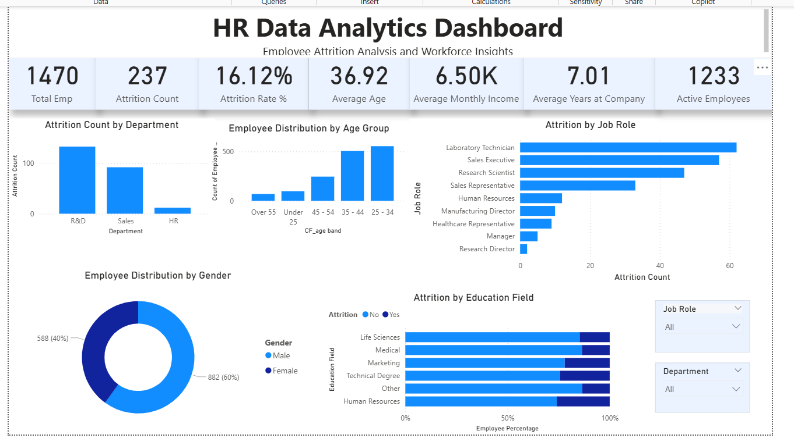
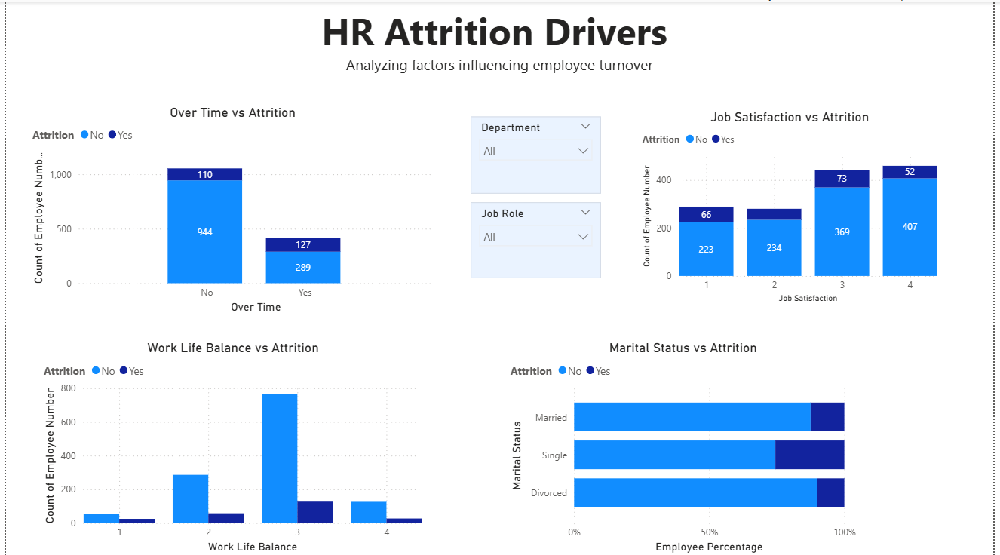

# HR Analytics Dashboard | Power BI

## Project Overview

This project presents an interactive HR Analytics Dashboard developed using Power BI to analyze employee attrition trends, workforce demographics, and factors influencing employee turnover.

The dashboard is divided into two pages:

### 1. Workforce Overview

Provides a comprehensive overview of the organization's workforce, including employee demographics, attrition metrics, and workforce distribution.

### 2. Attrition Drivers Analysis

Analyzes key factors contributing to employee attrition, helping identify patterns and potential retention challenges.

---

## Tools & Technologies Used

* Power BI
* DAX (Data Analysis Expressions)
* Power Query
* Data Modeling
* Data Visualization

---

## Key Performance Indicators (KPIs)

* Total Employees
* Active Employees
* Attrition Count
* Attrition Rate (%)
* Average Age
* Average Monthly Income
* Average Years at Company

---

## Dashboard Features

### Workforce Overview

* Attrition by Department
* Attrition by Job Role
* Employee Distribution by Age Group
* Employee Distribution by Gender
* Attrition by Education Field
* Interactive Filters (Department & Job Role)

### Attrition Drivers Analysis

* Over Time vs Attrition
* Job Satisfaction vs Attrition
* Work Life Balance vs Attrition
* Attrition by Marital Status
* Interactive Filters (Department & Job Role)

---

## Key Business Insights

### 1. Department-wise Attrition

Research & Development recorded the highest employee attrition, followed by the Sales department.

### 2. Job Role Analysis

Laboratory Technicians and Sales Executives experienced the highest employee turnover among all job roles.

### 3. Workforce Demographics

The majority of employees belong to the 25–44 age group, representing the largest segment of the workforce.

### 4. Gender Distribution

The organization’s workforce consists of approximately 60% male employees and 40% female employees.

### 5. Impact of Overtime

Employees working overtime exhibited higher attrition levels compared to employees who did not work overtime.

### 6. Job Satisfaction

Lower job satisfaction levels were associated with increased employee attrition, highlighting the importance of employee engagement.

### 7. Work-Life Balance

Employees reporting lower work-life balance scores showed relatively higher attrition levels.

### 8. Education Field Analysis

Attrition patterns varied across education fields, with Human Resources and Technical Degree backgrounds showing relatively higher attrition percentages.

### 9. Marital Status Analysis

Single employees demonstrated higher attrition compared to married and divorced employees.

### 10. Overall Attrition Rate

The organization recorded an attrition rate of 16.12%, with 237 employees leaving out of a total workforce of 1,470 employees.

---

## Dashboard Preview

### Workforce Overview

### Attrition Drivers Analysis

---

## Dataset

Employee Attrition Dataset containing workforce demographics, employee satisfaction metrics, job-related factors, and attrition information.

---

## Project Files

* HR Data.pbix
* HR Data.csv
* HR Insights.docx
* Dashboard Screenshots

---

## Author

**Vaishnavi Anumalasetty**

Aspiring Data Analyst passionate about transforming data into actionable business insights using SQL, Excel, Power BI, and Python.
